# Single- and multi-agent persistent monitoring tasks solved by the evolution strategy method

Green circles represent source locations, red squares represent targets, and blue cells represent environmental obstacles.

## 5 targets

| instance | 1 agent                                                          | 2 agents                                                         | 3 agents                                                         |
| -------- | ---------------------------------------------------------------- | ---------------------------------------------------------------- | ---------------------------------------------------------------- |
| 1        | 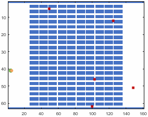  | 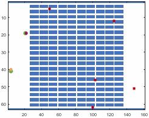  | 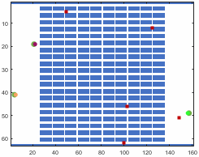  |
| 2        | 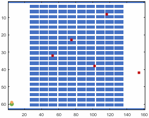  | 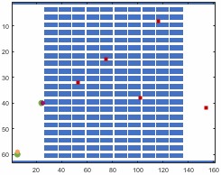  | 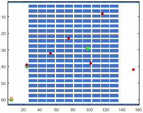  |
| 3        |   | 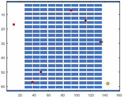  | 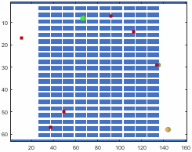  |
| 4        | 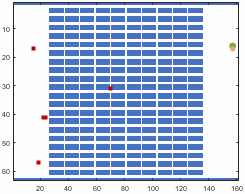  | 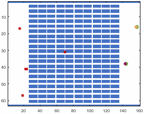  | 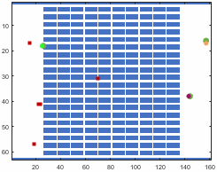  |
| 5        | 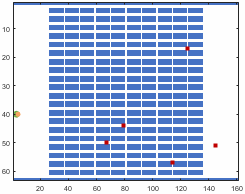  | 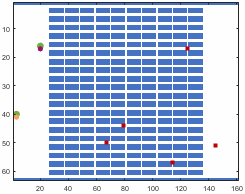  | 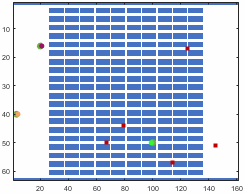  |
| 6        | 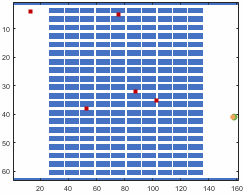  | 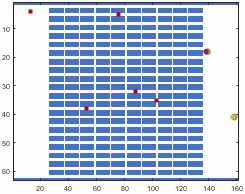  | 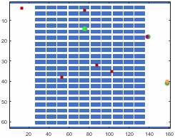  |
| 7        | 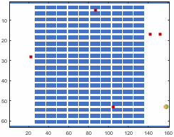  | 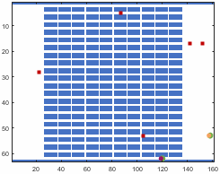  |   |
| 8        | 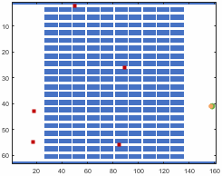  | 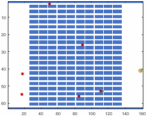  |   |
| 9        | 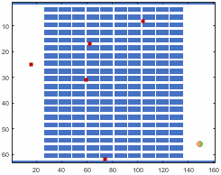  | 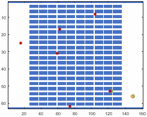  | 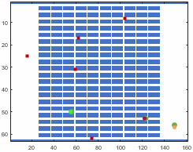  |
| 10       | 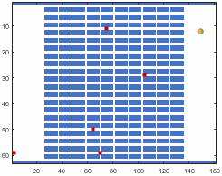 | 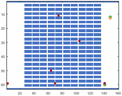 | 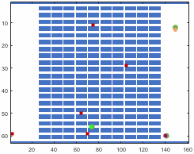 |

## 10 targets

| instance | 1 agent                                                           | 2 agents                                                          | 3 agents                                                          |
| -------- | ----------------------------------------------------------------- | ----------------------------------------------------------------- | ----------------------------------------------------------------- |
| 1        | 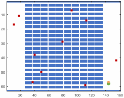  | 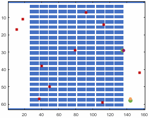  | 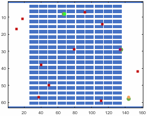  |
| 2        | 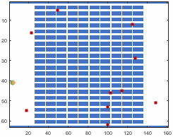  | 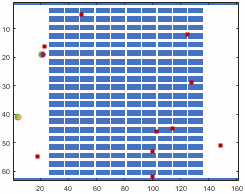  | 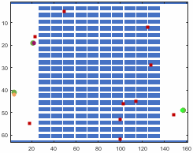  |
| 3        |   | 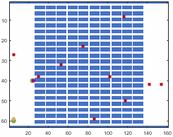  | 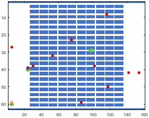  |
| 4        | 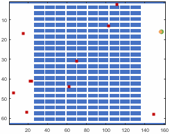  |   | 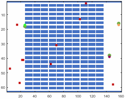  |
| 5        | 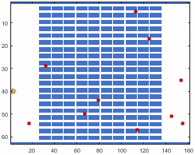  | 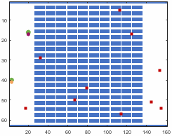  | 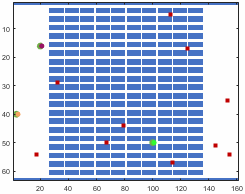  |
| 6        | 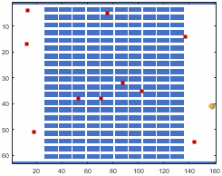  | 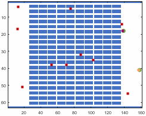  |   |
| 7        | 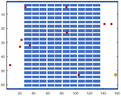  | 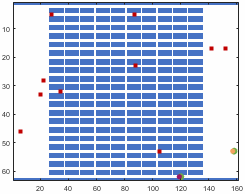  | 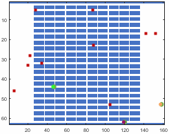  |
| 8        | 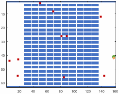  | 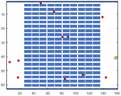  |   |
| 9        | 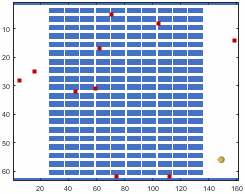  |   | 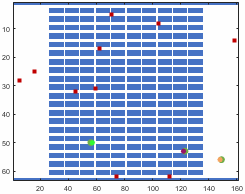  |
| 10       | 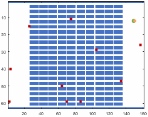 |  |  |

## 15 targets

| instance | 1 agent                                                           | 2 agents                                                          | 3 agents                                                          |
| -------- | ----------------------------------------------------------------- | ----------------------------------------------------------------- | ----------------------------------------------------------------- |
| 1        |   |   |   |
| 2        |   |   |   |
| 3        |   |   |   |
| 4        |   |   |   |
| 5        |   |   |   |
| 6        |   |   |   |
| 7        |   |   |   |
| 8        |   |   |   |
| 9        |   |   |   |
| 10       |  |  |  |

## 20 targets

| instance | 1 agent                                                           | 2 agents                                                          | 3 agents                                                          |
| -------- | ----------------------------------------------------------------- | ----------------------------------------------------------------- | ----------------------------------------------------------------- |
| 1        |   |   |   |
| 2        |   |   |   |
| 3        |   |   |   |
| 4        |   |   |   |
| 5        |   |   |   |
| 6        |   |   |   |
| 7        |   |   |   |
| 8        |   |   |   |
| 9        |   |   |   |
| 10       |  |  |  |
